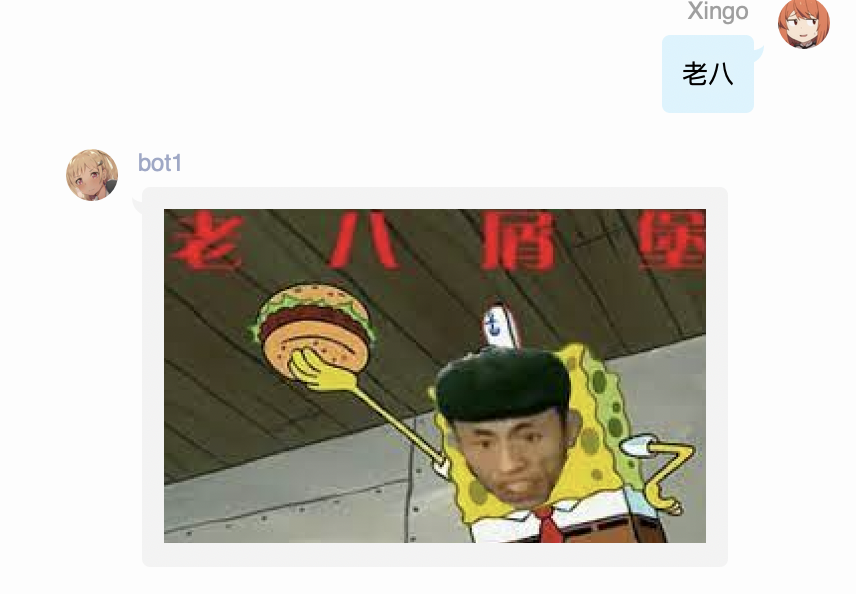
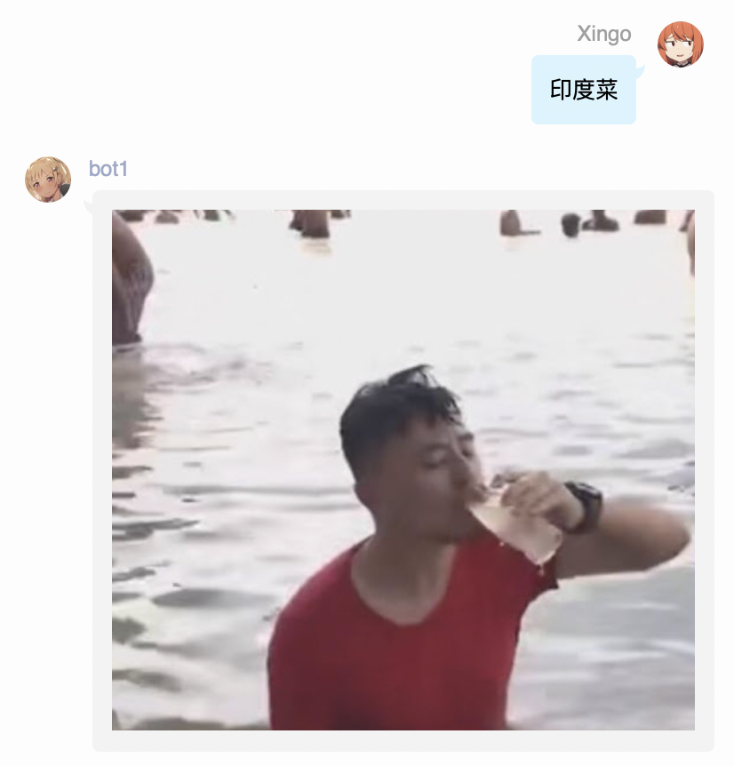

## 老八 庸子插件
不会写python  照猫画虎写了个

图片还很少，欢迎大家交pr增加，或是自己使用的时候增加。

### bot config

```js
MODULES_ON = {
    ...
    'lao8',
    ...
}
```

### image
lao8文件夹移动到res下

### how to use
- "老八", "来点老八", "来点下饭", "下饭菜" 发老八的图

  

- "庸子", "来点庸子", "来点刘庸", "来点印度菜", "印度菜" 发庸子的图


